# iOS

All my iOS apps developed by me so far. I just started this journey :)

In this repo you can find the complete XCode projects for each of those apps (and exercises).

###first app ever
This application is as simple as it can be:
- empty view with one "lame" button
- a second "great" view with a message and an image
- when the button from first view is pressed, the second view §magically§ appears 

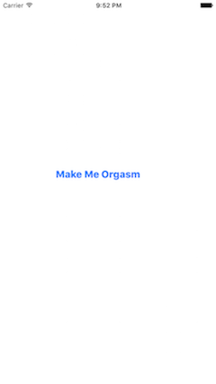
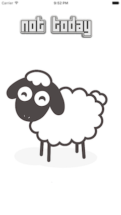

###Red and Blue
This is another simple and basic iphone app which starts with 2 images and 2 buttons.

Whenever a click on each button happens, the corresponding image disapears and the button's name will be changed.

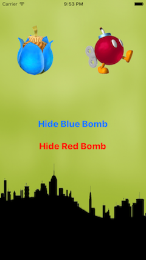

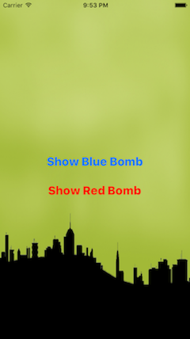
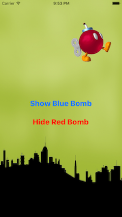

### auto layout with <b>constraints</b>
As I soon found out, it is very important how one designs an app.

While it might look perfect on a specific device(e.g. iphone6), the same app on other devices might be a mess.

Here are the results of a very basic app which works great no matter the device:

And here is another exercise I made that illustrated again those concepts:

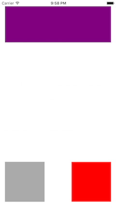

###Tap Tap
Tap Tap is a game in which a user has to... YES - TAP! 

The initial view starts with:
- the logo of the game (Tap Tap)
- a text field to introduce the number of taps a user wants to do
- a play button

When clicking the "play" button, the second view starts. It contains:
- the tap button
- a label that displays the taps number

If the taps number has reached the number inputed by the user, the game restarts.

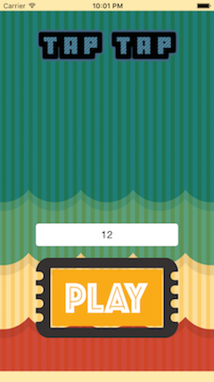
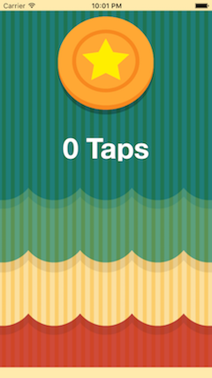
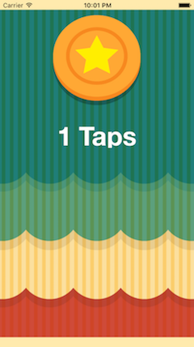

###Multiples
Multiplication by addition. Simplest form of multiplication. Designed for children who wish to practice.
The game itself takes an integer from user input and multiplies it a number of time (for the moment is hardcoded, and it's 10).
When the max number of multiplication is reached, the game restarts. User can input new number after restarting.
Game works on any display.

The initial view starts with:
- the logo of the game (Multiples)
- a text field to introduce the number to be multiplies with itself
- a play button

When clicking the "play" button, the second view starts. It contains:
- a label with instructions
- the "Add" button
- the label will show the results 

If the max number of multiplication has been reached(10), the game restarts.

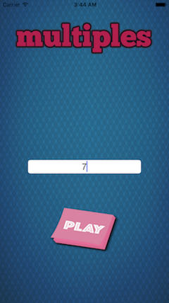

###Intro to Stack View
>"Powerful tool Stack View is, careful you must be."

Learning a new way than simple [constraints](#constraints) to design an app in a responsive manner.
Stack Views are a great, great way to organize your app. I recommend using them as a habbit, and use constraints only when necessary.

So the design is a simple Shoe App without any backend functionality.

###Robo Calculator
>"R2, you miss-calculated the coordinates. Let me do them by myself... Uh, what a rusty robot

Today I have built a... CALCULATOR. Is is an old style retro calculator with basic functionality.
Key operations that it supports are
- Addition
- Substraction
- Multiplication
- Division
- It also has a special feature to ERASE or CLEAR.
- 
####To CLEAR just double tap on the RESULT LABEL

The design is build using [stack view](#stackView)stack view and [constraints](#constraints).
It also has an incorporated Audio Player, and when any button is tapped a sound will be played.
Audio Played is built using AVFoundation framework.

It has a launch screen which looks like : 

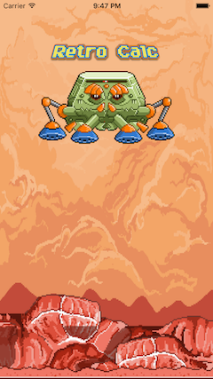

An the app itself is this one: 

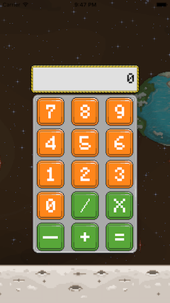
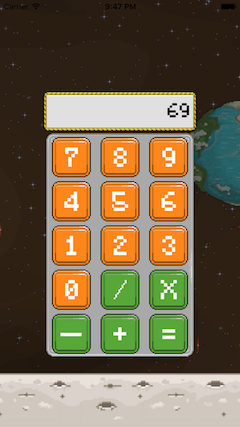
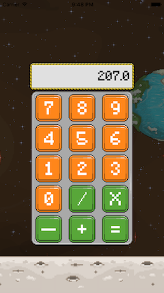

